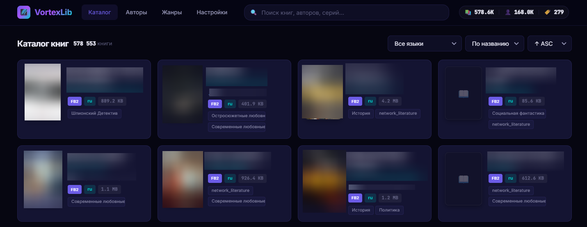
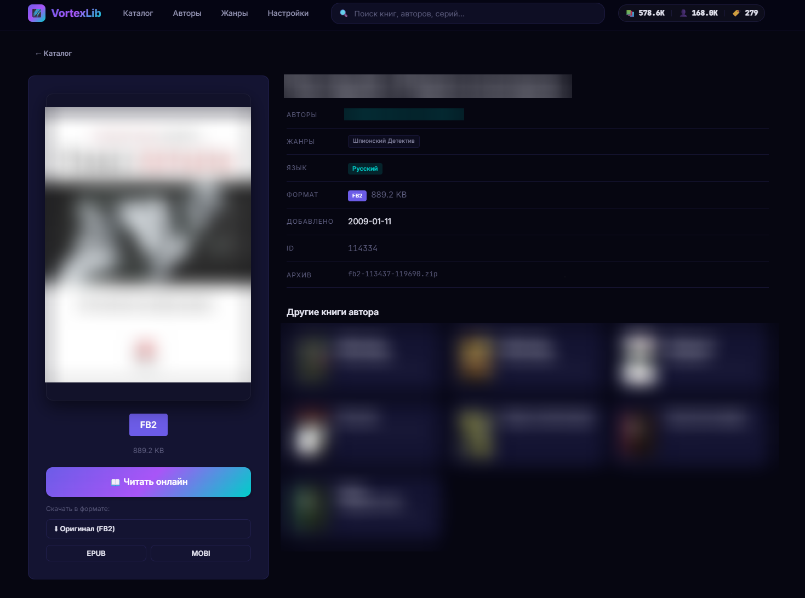

# VortexLib

**VortexLib** — это современная, сверхбыстрая веб-библиотека для управления и чтения локальной коллекции FB2-книг. Проект создан для тех, кто хранит архивы или собственные коллекции электронных книг и хочет иметь удобный доступ к ним через браузер с любого устройства.


## Интерфейс


*Главная страница с каталогом книг и умными фильтрами*


*Страница книги с возможностью чтения онлайн и конвертации форматов*

## Ключевые особенности

- **Визуальный каталог**: Автоматическое извлечение и отображение обложек напрямую из FB2-файлов, хранящихся внутри ZIP-архивов.
- **Встроенная читалка**:
    - Полноэкранный режим чтения в браузере.
    - Настраиваемые темы (Светлая, Сепия, Темная, Ночная).
    - Кастомизация шрифтов и размера текста.
    - Автоматическое сохранение прогресса чтения для каждой книги.
- **Конвертация на лету**: Возможность скачивания любой книги в форматах **EPUB** или **MOBI** (автоматическая перепаковка на бэкенде через Calibre).
- **Поддержка гигантских архивов**: Использование потоковой декомпрессии (yauzl) позволяет работать с ZIP-архивами размером 2ГБ+ без нагрузки на RAM.
- **Мгновенный поиск**: Полнотекстовый поиск (FTS5) по названиям, авторам и сериям.
- **Умный импорт**: Индексация библиотеки через `.inpx` файлы. Настройка размера чанков позволяет оптимизировать скорость импорта под ваше железо.
- **Современный UX**: Дизайн в стиле "Deep Space", иконки, плавные анимации и адаптивность под мобильные устройства.
- **Docker Native**: Полная поддержка контейнеризации для Windows (Docker Desktop) и Linux.

## Стек технологий

- **Framework**: [Nuxt 4](https://nuxt.com/) (Vue 3, Nitro, Vite)
- **Database**: SQLite ([Better-SQLite3](https://github.com/WiseLibs/better-sqlite3)) + [Drizzle ORM](https://orm.drizzle.team/)
- **Auth**: [nuxt-auth-utils](https://github.com/Atinux/nuxt-auth-utils) (SSR Sessions)
- **Processing**: `yauzl` (ZIP), `cheerio` (FB2/XML), `calibre` (Conversion)
- **Styling**: Vanilla CSS

## Установка и запуск

### Вариант 1: Docker (Рекомендуется)

Самый быстрый способ запустить VortexLib на любой ОС — использовать Docker Compose.

1. **Создайте файл `docker-compose.yml`**:
   ```yaml
   version: "3.9"
   services:
     vortexlib:
       image: einkrieger/vortexlib:latest
       build: .
       container_name: vortexlib
       ports:
         - "4224:4224"
       environment:
         NUXT_SESSION_PASSWORD: "придумайте_длинный_пароль_32_символа"
         DOCKERIZED: "true"
       volumes:
         - vortexlib_data:/app/data
         - "D:/MyBooks:/library:ro" # Путь к архивам и .inpx файлам на хосте
       restart: unless-stopped
   volumes:
     vortexlib_data:
   ```

2. **Запустите**:
   ```bash
   docker-compose up -d
   ```

### Вариант 2: Локальный запуск (Node.js)

1. **Предварительные требования**:
   - Node.js v18+
   - Calibre (`sudo apt install calibre -y`)

2. **Настройка**:
   ```bash
   npm install
   cp .env.example .env # Настройте пути и секреты в .env
   ```

3. **Запуск**:
   ```bash
   npm run dev
   ```

## Архитектура путей в Docker
Внутри контейнера VortexLib зафиксированы следующие пути:
- `/library` — ваша коллекция книг (монтируется как volume).
- `/app/data/library.db` — база данных SQLite.
- `/app` — рабочая директория приложения.

## Лицензия
Проект распространяется под лицензией **GNU GPL v3**. Разработано **EinKRieGeR**.
Никаких готовых библиотек или книг в составе проекта нет. Все права на книги принадлежат их авторам.
